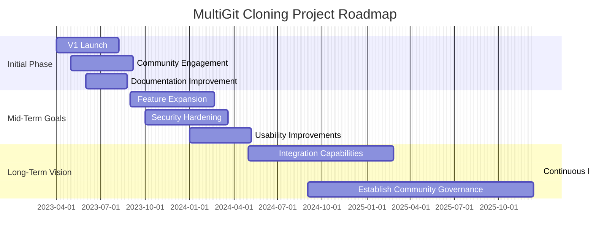
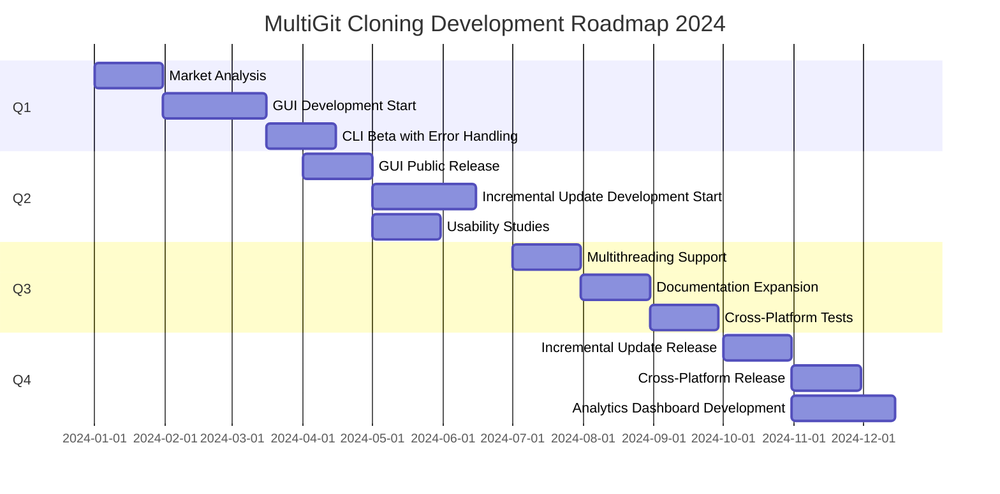

# [roadmap](http://roadmap.multigit.com)

## Menu:

+ [www.multigit.com](http://www.multigit.com)
+ [identity](http://identity.multigit.com)
+ [roadmap](http://roadmap.multigit.com)

## Description

**Short-Term (0-6 months):**
- **V1 Launch:** Release the initial version featuring basic functionalities such as cloning multiple repositories, handling branch specifications, and skipping forks.
- **Community Engagement:** Start active engagement on platforms like GitHub, Twitter, and relevant online forums to gather feedback and encourage initial adoption.
- **Documentation Improvement:** Develop comprehensive user guides, developer documentation, and contributing guidelines.

**Mid-Term (6-12 months):**
- **Feature Expansion:** Based on community feedback, add new features such as repository structure verification and automatic repository creation within the specified organization.
- **Security Hardening:** Implement enhanced security features, including better management and encryption of API tokens.
- **Usability Improvements:** Release updates focusing on improving the user interface and experience, making setup, configuration, and usage as intuitive as possible.

**Long-Term (1-2 years):**
- **Integration Capabilities:** Develop plugins or extensions to easily integrate with IDEs (Integrated Development Environments) and other development tools.
- **Continuous Improvement:** Keep refining the tool based on ongoing user feedback, adapting to changes in GitHub API, and staying current with best practices in software development and open-source contribution.
- **Establish Community Governance:** Form a core team of contributors responsible for guiding the project's direction, reviewing contributions, and managing releases.

This roadmap seeks to direct the project towards sustainability, relevance, and impactful contributions to the global developer community.

## Planning

### Notes on Interpreting This Roadmap
- The roadmap starts from April 2023, outlining plans up till August 2025.
- It divides objectives into three main sections: Initial Phase, Mid-Term Goals, and Long-Term Vision.
- Tasks like 'V1 Launch,' 'Feature Expansion,' and 'Integration Capabilities' mark significant milestones.
- "Excludes weekends" denotes focusing on weekdays for the project's timeline; the specific exclusion of "2023-05-01, 2023-12-25" showcases holidays or planned non-working periods by the project team.

## Roadmap for 2024:

Q1:
- Perform an in-depth market analysis to understand user needs and trends better.
- Begin development of the GUI, focusing on a clean and intuitive design.
- Release a CLI beta version featuring enhanced error management capabilities for select users.

Q2:
- Officially release the GUI version for public use, targeting non-technical audiences.
- Start implementing an incremental update feature in the CLI, following beta testing feedback.
- Conduct usability studies to refine both interfaces.

Q3:
- Roll out multithreading support for concurrent cloning and performance optimization.
- Introduce expanded documentation with comprehensive use cases and tutorials.
- Initiate cross-platform compatibility tests and address OS-specific issues.

Q4:
- Release the incremental update feature to reduce bandwidth usage and improve efficiency.
- Launch a full-fledged cross-platform compatible version of MultiGit Cloning.
- Develop an analytics dashboard for organizations to monitor usage patterns and operational metrics.

Throughout the year, the focus will be on gathering user feedback, refining existing features, ensuring robust security practices, and providing steady updates to support the latest GitHub features. By continuing to incorporate user insights into the development life cycle, MultiGit Cloning aims to evolve into a robust, inevitable tool in developers' and teams' arsenals worldwide.

